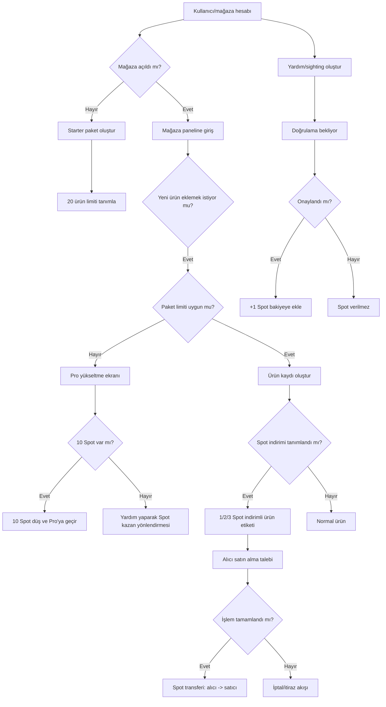

# SpotItForMe — Mağaza + Spot Ekonomisi İş Akışı ve Uygulama Raporu

**Versiyon:** v1.0  
**Tarih:** 7 Mart 2026  
**Durum:** Aktif Yol Haritası (Tek Referans Doküman)

---

## 1) Amaç ve Kapsam

Bu doküman, mağaza sistemi ve Spot ekonomisinin (ödeme sistemi olmadan) adım adım nasıl kurulacağını tanımlar.

Bu dosyanın amacı:
- Hedefleri unutmamak
- Uygulama sırasını netleştirmek
- Kuralları sabitlemek
- Her geliştirme oturumunda aynı plana bağlı kalmak

**Kural:** Bu oluşum tamamlanana kadar her oturum başında bu dosya okunur ve bir sonraki madde uygulanır.

---

## 2) Temel Strateji

### 2.1 Spot tanımı
Spot, **nakde çevrilemeyen platform içi indirim hakkı/puanıdır**.

### 2.2 Başlangıç prensibi
- Başlangıçta doğrudan ödeme altyapısı yok
- Spot, mağaza avantajları ve indirimlerde kullanılacak
- Sonraki aşamalarda ödeme altyapısı eklenebilir

### 2.3 Hukuki güvenli tanım
- Spot = dijital para değil
- Spot = sadakat/indirim hakkı
- Kullanım alanı platform içi avantajlarla sınırlı

---

## 3) Net İş Kuralları (Sabit Kurallar)

## 3.1 Mağaza paketleri
- **Starter Paket:** 20 ürün hakkı (ücretsiz)
- **Pro Paket:** 100 ürün hakkı
- **Pro fiyatı:** yıllık 10 USD eşdeğeri
- Ödeme sistemi yokken Pro geçiş: **10 Spot kullanımı**

## 3.2 Spot kazanımı
- Her doğrulanmış yardım/sighting için: **+1 Spot**
- Yardımın Spot getirmesi için doğrulama zorunlu

## 3.3 Spot harcama alanları
- Pro pakete yükseltme (10 Spot)
- Ürünlerde Spot indirim kullanımı (1/2/3 Spot)
- Gelecek: vitrin/öne çıkarma/rozet gibi alanlar

## 3.4 Ürün Spot indirimi
- Mağaza ürüne Spot indirimi tanımlar: `1 Spot`, `2 Spot`, `3 Spot`
- Alıcı kullanırsa, Spot alıcıdan düşer, satıcıya aktarılır
- Satın alma fiziksel/mesajlaşma/telefon üzerinden tamamlanabilir; platform transfer kayıtlarını tutar

---

## 4) Uçtan Uca İş Akışı Şeması

---

## 5) Doğrulama ve Anti-Fraud Kurgusu

Spot ekonomisinin çalışması için suistimal önleme zorunludur.

## 5.1 Yardım doğrulama
- Yardımı alan tarafın onayı
- Zaman penceresi (örn. 72 saat içinde onay/itiraz)
- Gerekirse admin incelemesi

## 5.2 Suistimal sinyalleri
- Aynı iki hesap arasında tekrarlı karşılıklı onay
- Aşırı kısa sürede çok fazla yardım
- Aynı cihaz/IP paternleri

## 5.3 Koruyucu kurallar
- Günlük/haftalık Spot kazanım limiti
- Aynı eşleşmeden kazanım sınırı
- Şüpheli işlemlerde geçici dondurma

---

## 6) Teknik Mimari Planı

## 6.1 Veri modeli (özet)
Oluşturulacak temel tablolar:
- `spot_wallets` (kullanıcı_id, bakiye)
- `spot_ledger` (from_user, to_user, amount, reason, ref_id, status)
- `store_plans` (store_id, plan_type, product_limit, expires_at)
- `spot_earn_events` (event_type, source_id, approved_by, approved_at)
- `spot_discount_products` (product_id, discount_spot_amount)
- `spot_purchase_transfers` (buyer_id, seller_id, product_id, spot_amount, state)

## 6.2 API katmanı (özet)
Planlanan endpoint seti:
- `POST /api/spot/earn/approve`
- `POST /api/spot/transfer`
- `POST /api/store/upgrade-plan`
- `POST /api/store/product/apply-spot-discount`
- `GET /api/spot/wallet`
- `GET /api/spot/ledger`

## 6.3 UI akışları (özet)
- Mağaza panelinde paket göstergesi (20/100 limit)
- Pro yükseltme kartı (10 Spot)
- Spot cüzdan bileşeni
- Ürün formunda Spot indirim seçimi
- İşlem onay ekranı (Spot transfer tamamlandı)

---

## 7) Uygulama Fazları ve Sıra

## Faz 0 — Hazırlık
- [ ] İş kural setinin freeze edilmesi
- [ ] Terimlerin sabitlenmesi (Spot = indirim hakkı)
- [ ] RLS/izin stratejisinin netleşmesi

## Faz 1 — Cüzdan ve Ledger
- [x] `spot_wallets` + `spot_ledger` tabloları
- [x] Bakiye hesaplama/okuma fonksiyonları
- [ ] İlk admin test transferleri

## Faz 2 — Yardım Onayı -> Spot Kazanımı
- [ ] Yardım doğrulama state makinesi
- [ ] Onaylanınca +1 Spot işlenmesi
- [ ] Çift ödül ve tekrar ödül engeli

## Faz 3 — Mağaza Paket Sistemi
- [ ] Starter 20 ürün limiti
- [ ] Pro 100 ürün limiti
- [ ] Spot ile yükseltme (10 Spot düşüm)

## Faz 4 — Spot İndirimli Ürün
- [ ] Ürüne 1/2/3 Spot indirim tanımı
- [ ] Satın alma sonrası Spot transfer akışı
- [ ] İtiraz ve iptal akışı

## Faz 5 — Anti-Fraud + Moderasyon
- [ ] Limit kuralları
- [ ] Şüpheli patern tespiti
- [ ] Admin karar ekranı

## Faz 6 — Nadir Gördüm Müzesi (Genişleme)
- [ ] Müze koleksiyon sayfası
- [ ] Spot karşılığı foto satış listesi
- [ ] Haftalık açık artırma günü altyapısı

---

## 8) Nadir Gördüm Müzesi — Gelecek Tasarım

## 8.1 Değer önerisi
- Nadir içerik üreten kullanıcılar Spot kazanır
- Spot için güçlü bir harcama alanı oluşur
- Platformda topluluk ve içerik kalitesi artar

## 8.2 MVP önerisi
1. Sabit Spot fiyatlı foto listeleme
2. Escrow benzeri Spot bekletme
3. Teslim/onay sonrası Spot aktarımı

## 8.3 Açık artırma önerisi
- Haftalık özel gün (örn. Cumartesi 20:00)
- Son dakika teklifine uzatma (anti-sniping)
- Bitiş sonrası otomatik kazanan + transfer akışı

---

## 9) KPI ve Başarı Ölçütleri

İlk 90 gün hedef KPI seti:
- Yardım doğrulama oranı
- Spot kazanım/harcama dengesi
- Starter -> Pro geçiş oranı
- Spot indirimli ürün işlem sayısı
- İtiraz/iptal oranı

---

## 10) Riskler ve Önlemler

- **Risk:** Spot enflasyonu  
  **Önlem:** Harcama alanlarını artır, kazanım limitleri koy

- **Risk:** Yardım sahteciliği  
  **Önlem:** Çift onay + limit + patern analizi

- **Risk:** Kullanıcıların “para” algısı  
  **Önlem:** Tüm metinlerde “indirim hakkı/puan” ifadesi

- **Risk:** Ödeme sistemi yokken işlem anlaşmazlığı  
  **Önlem:** İşlem onay adımı + itiraz penceresi + admin karar kaydı

---

## 11) Çalışma Protokolü (Sen + Ben)

Her yeni oturumda aşağıdaki sırayla ilerlenir:

1. Bu dosya okunur
2. “Fazlar” bölümünde ilk tamamlanmamış görev seçilir
3. Sadece o görevin kapsamı geliştirilir
4. Test/build doğrulaması yapılır
5. Bu dosyada “İlerleme Kaydı” güncellenir

**Kural:** Faz sırası bozulmadan ilerlenir (istisna: acil prod bug).

---

## 12) İlerleme Kaydı

## 2026-03-07
- Bu ana plan dokümanı oluşturuldu
- Mağaza + Spot ekonomisi kuralları donduruldu (v1.0)
- Nadir Gördüm Müzesi, faz 6 genişleme olarak plana eklendi
- Faz 1 başlangıcı uygulandı: `spot_wallets`, `spot_ledger`, ve Spot RPC fonksiyonları eklendi
- Migration dosyası eklendi: `20260307_create_spot_wallet_and_ledger.sql`
- Faz 1 admin doğrulama scripti eklendi: `20260307_spot_wallet_admin_test.sql`

---

## 13) Sonraki Net Adım (Bir Sonraki Oturum)

**Başlangıç görevi:** Faz 1 — ilk admin test transferlerini çalıştırmak ve doğrulamak.

Bu tamamlanmadan Faz 2’ye geçilmez.
